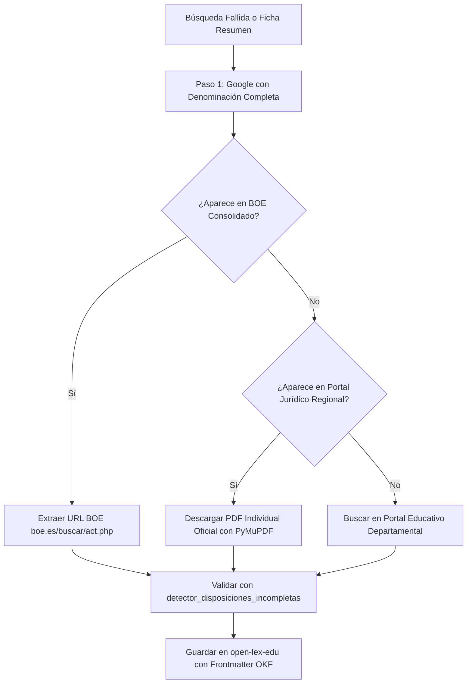

# Manual Maestro: Estrategias de Recopilación de Normativa Educativa Autonómica

Este documento constituye la **guía técnica y operativa estándar** para la identificación, raspado (*harvesting*), verificación de integridad y transcripción articulada de la normativa jurídica educativa no universitaria en las **17 Comunidades Autónomas y 2 Ciudades Autónomas de España**.

---

## 🧭 Metodología General y Reglas de Dominio (Anti-Ficha)

Toda estrategia de recopilación autonómica debe observar estrictamente los siguientes cuatro principios obligatorios:

1. **Regla del PDF Individual del Diario Oficial**: Al extraer del diario oficial autonómico, debe localizarse siempre el archivo PDF oficial de la disposición articulada individual (nunca índices, sumarios generales del boletín ni textos de cabecera reducidos).
2. **Regla Anti-Ficha Técnica**: Queda terminantemente prohibido incorporar fichas resumen, índices o portadas de buscadores regionales. Si un portal autonómico sólo ofrece ficha resumen, la norma debe recuperarse vía búsqueda directa en Google o en el repositorio consolidado del BOE (`boe.es/buscar/act.php`).
3. **Verificación Estricta Título-Cuerpo**: Antes de consolidar el texto, debe verificarse que el número de disposición (`numero_disposicion`), el año y el objeto del título coinciden de forma exacta en el encabezado y en el articulado inicial (`## Preámbulo` / `## Artículo 1`).
4. **Instrucciones Departamentales de Inicio de Curso**: Es obligatorio auditar periódicamente los portales educativos de las Consejerías para rastrear Resoluciones de Direcciones Generales no publicadas en boletín, Instrucciones de Organización y Funcionamiento (IOF), calendarios y protocolos vigentes (LOPIVI, salud mental, prevención del suicidio, regulación de teléfonos móviles).

---

## 🏛️ Taxonomía Canónica Simétrica (9 Categorías)

Toda disposición debe clasificarse exclusivamente en una de las siguientes 9 categorías:

| Código | Categoría Canónica | Materia y Ámbito |
| :--- | :--- | :--- |
| `01_marco_normativo_general_y_organico` | **Marco Normativo General y Orgánico** | Leyes educativas autonómicas, Estatutos, decretos de estructura orgánica de la Consejería, reglamentos de inspección educativa. |
| `02_gestion_y_administracion_centros` | **Gestión y Administración de Centros** | Reglamentos Orgánicos de Centros (ROC), autonomía de gestión económica, órganos de gobierno (director, consejo escolar, claustro), conciertos educativos. |
| `03_ordenacion_curricular_y_ensenanzas` | **Ordenación Curricular y Enseñanzas** | Decretos y órdenes curriculares de Infantil, Primaria, ESO, Bachillerato, FP, EOI, Artísticas, Deportivas y Educación de Personas Adultas. Evaluación y promoción. |
| `04_organizacion_escolar_y_funcionamiento` | **Organización Escolar y Funcionamiento** | Instrucciones de inicio de curso (IOF), calendario escolar, jornada escolar, horarios y organización de centros integrados de FP (CIFP). |
| `05_alumnado_y_servicios_escolares` | **Alumnado y Servicios Escolares** | Procedimiento de admisión y matrícula, becas y ayudas al estudio, comedores escolares, transporte escolar, libros de texto y gratuidad. |
| `06_atencion_diversidad_y_orientacion` | **Atención a la Diversidad y Orientación** | Inclusión educativa, alumnado con NEAE/NEE, altas capacidades, centros de educación especial, equipos de orientación (EOEP/EOE) y profesorado de apoyo. |
| `07_convivencia_bienestar_y_protocolos` | **Convivencia, Bienestar y Protocolos** | Planes de convivencia, protocolos de acoso escolar y ciberacoso, coordinador de bienestar (LOPIVI), prevención de conductas suicidas, uso de dispositivos móviles. |
| `08_personal_docente` | **Personal Docente** | Acceso y selección docente, interinidades y listas de empleo, concurso de traslados, plantillas orgánicas, permisos, licencias, sexenios y carrera docente. |
| `09_personal_laboral_y_no_docente` | **Personal Laboral y No Docente** | Personal de administración y servicios (PAS), educadores infantiles, personal auxiliar técnico educativo (ATE/PTIS), convenios colectivos del personal laboral docente y no docente. |

---

## 🗺️ Fichas Técnicas de Recopilación por Comunidad Autónoma

---

### 1. Andalucía
* **Diario Oficial**: **BOJA** (Boletín Oficial de la Junta de Andalucía).
* **Sede del Boletín**: `https://www.juntadeandalucia.es/boja/` | Edición electrónica `https://www.juntadeandalucia.es/eboja`.
* **Portal Consolidado Autonómico**: Portal de la Junta de Andalucía (`juntadeandalucia.es/servicios/normativa.html`) y BOE Consolidado.
* **Portal Educativo Oficial**: `https://www.juntadeandalucia.es/educacion/` (Consejería de Desarrollo Educativo y Formación Profesional).
* **Denominación Consejería**: *Consejería de Desarrollo Educativo y Formación Profesional* (históricas: *Consejería de Educación y Deporte*, *Consejería de Educación*, *Consejería de Educación y Ciencia*).
* **Mapeo de Órganos Directivos**:
  * `01_dg_personal`: DG del Profesorado y Gestión de Recursos Humanos.
  * `02_dg_ordenacion`: DG de Ordenación, Inclusión e Innovación Educativa.
  * `03_dg_fp_ensenanzas`: DG de Formación Profesional y Régimen Especial.
  * `04_dg_centros_infraestructura`: DG de Planificación, Centros y Enseñanza Concertada.
  * `05_secretaria_general_tecnica`: Secretaría General Técnica / Secretaría General de Educación.
  * `06_dg_juventud_deportes`: DG de Sistemas y Valores del Deporte (ámbito escolar).
  * `07_accuee_evaluacion`: Agencia Andaluza de Evaluación Educativa (AGAEVE) / Servicios de Evaluación.
  * `08_inspeccion_consejo_escolar`: Inspección General de Educación / Consejo Escolar de Andalucía.
  * `09_consejeria_directa`: Consejería (Órgano Central y Viceconsejería).
* **Estrategia de Extracción**: Búsqueda por rango de años en sumario BOJA. Para decretos de estructura orgánica o currículo, revisar ediciones extraordinarias de BOJA. Extraer circulares e instrucciones de inicio de curso desde el portal de la Consejería.

---

### 2. Aragón
* **Diario Oficial**: **BOA** (Boletín Oficial de Aragón).
* **Sede del Boletín**: `https://www.boa.aragon.es/`.
* **Portal Consolidado Autonómico**: Repositorio de Legislación de Aragón (`aragon.es/-/normativa`) y BOE Consolidado.
* **Portal Educativo Oficial**: `https://educa.aragon.es/` (Educaragón).
* **Denominación Consejería**: *Departamento de Educación, Ciencia y Universidades* (históricas: *Departamento de Educación, Cultura y Deporte*, *Departamento de Educación, Universidad, Cultura y Deporte*).
* **Mapeo de Órganos Directivos**:
  * `01_dg_personal`: DG de Personal Docente.
  * `02_dg_ordenacion`: DG de Política Educativa, Ordenación Académica y Educación Permanente.
  * `03_dg_fp_ensenanzas`: DG de Formación Profesional.
  * `04_dg_centros_infraestructura`: DG de Planificación, Centros y Formación Profesional.
  * `05_secretaria_general_tecnica`: Secretaría General Técnica del Departamento.
  * `06_dg_juventud_deportes`: DG de Deporte (programas escolares).
  * `07_accuee_evaluacion`: Servicio de Evaluación y Calidad Educativa.
  * `08_inspeccion_consejo_escolar`: Servicio Provincial de Inspección / Consejo Escolar de Aragón.
  * `09_consejeria_directa`: Consejero/a y Dirección del Departamento.
* **Estrategia de Extracción**: Localizar el identificador de disposición BOA (`BOA-A-YYYY-NNNN`) o descarga del PDF oficial individualizado. Rastrear en `educa.aragon.es` las Resoluciones de inicio de curso e instrucciones sobre inclusión y convivencia.

---

### 3. Principado de Asturias
* **Diario Oficial**: **BOPA** (Boletín Oficial del Principado de Asturias).
* **Sede del Boletín**: `https://sede.asturias.es/bopa`.
* **Portal Consolidado Autonómico**: Base de Datos de Legislación del Principado (`asturias.es`) y BOE Consolidado.
* **Portal Educativo Oficial**: `https://www.educastur.es/` (Educastur).
* **Denominación Consejería**: *Consejería de Educación*.
* **Mapeo de Órganos Directivos**:
  * `01_dg_personal`: DG de Personal Docente.
  * `02_dg_ordenacion`: DG de Inclusión Educativa y Ordenación.
  * `03_dg_fp_ensenanzas`: DG de Formación Profesional y Enseñanzas de Régimen Especial.
  * `04_dg_centros_infraestructura`: DG de Centros, Red 0-3 y Enseñanzas Profesionales.
  * `05_secretaria_general_tecnica`: Secretaría General Técnica de Educación.
  * `06_dg_juventud_deportes`: DG de Actividad Física y Deporte.
  * `07_accuee_evaluacion`: Servicio de Evaluación Educativa.
  * `08_inspeccion_consejo_escolar`: Servicio de Inspección Educativa / Consejo Escolar del Principado de Asturias.
  * `09_consejeria_directa`: Consejería de Educación (Órgano Central y Viceconsejería).
* **Estrategia de Extracción**: Descarga del PDF oficial con firma digital en `sede.asturias.es/bopa`. Consulta en Educastur de las orientaciones para el curso escolar, planes PROA+ y protocolos ante el acoso y ciberacoso.

---

### 4. Illes Balears
* **Diario Oficial**: **BOIB** (Butlletí Oficial de les Illes Balears).
* **Sede del Boletín**: `https://www.caib.es/eboibfront/`.
* **Portal Consolidado Autonómico**: Portal Jurídic de les Illes Balears (`caib.es`) y BOE Consolidado.
* **Portal Educativo Oficial**: `https://www.caib.es/sites/educacio/` / `https://weib.caib.es/` (Web Educativa de les Illes Balears).
* **Denominación Consejería**: *Conselleria d'Educació i Universitats* (históricas: *Conselleria d'Educació i Formació Professional*, *Conselleria d'Educació, Cultura i Universitats*).
* **Mapeo de Órganos Directivos**:
  * `01_dg_personal`: Direcció General de Personal Docent i Centres Concertats.
  * `02_dg_ordenacion`: Direcció General d'Ordenació dels Ensenyaments, Inclusió i Política Lingüística.
  * `03_dg_fp_ensenanzas`: Direcció General de Formació Professional i Ordenació Educativa.
  * `04_dg_centros_infraestructura`: Direcció General de Planificació i Infraestructures Educatives (IBISEC).
  * `05_secretaria_general_tecnica`: Secretaria General de la Conselleria.
  * `06_dg_juventud_deportes`: Direcció General d'Esports.
  * `07_accuee_evaluacion`: Institut d'Avaluació i Qualitat del Sistema Educatiu (IAQSE).
  * `08_inspeccion_consejo_escolar`: Departament d'Inspecció Educativa / Consell Escolar de les Illes Balears.
  * `09_consejeria_directa`: Conseller/a d'Educació i Secretaria Autonòmica d'Educació.
* **Estrategia de Extracción**: Descarga directa de los fascículos en PDF individual del BOIB. Atención prioritaria a la versión bilingüe (catalán/castellano) seleccionando el texto en castellano para homogeneidad con la base OKF o preservando la redacción oficial con metadato lingüístico.

---

### 5. Canarias
* **Diario Oficial**: **BOC** (Boletín Oficial de Canarias).
* **Sede del Boletín**: `https://www.gobiernodecanarias.org/boc/` | Sede: `https://sede.gobiernodecanarias.org/boc/`.
* **Portal Consolidado Autonómico**: **Juriscan** (Libro Azul) (`gobiernodecanarias.org/juriscan/`) y BOE Consolidado.
* **Portal Educativo Oficial**: `https://www.gobiernodecanarias.org/educacion/web/`.
* **Denominación Consejería**: *Consejería de Educación, Formación Profesional, Actividad Física y Deportes* (históricas: *Consejería de Educación, Universidades, Cultura y Deportes*).
* **Mapeo de Órganos Directivos**:
  * `01_dg_personal`: DG de Personal y Formación del Profesorado.
  * `02_dg_ordenacion`: DG de Ordenación de las Enseñanzas, Inclusión e Innovación.
  * `03_dg_fp_ensenanzas`: DG de Formación Profesional y Enseñanzas de Régimen Especial.
  * `04_dg_centros_infraestructura`: DG de Administración de Centros, Escolarización y Servicios Complementarios / DG de Infraestructuras y Equipamientos.
  * `05_secretaria_general_tecnica`: Secretaría General Técnica.
  * `06_dg_juventud_deportes`: DG de la Actividad Física y el Deporte (edad escolar).
  * `07_accuee_evaluacion`: Agencia Canaria de Calidad Universitaria y Evaluación Educativa (ACCUEE).
  * `08_inspeccion_consejo_escolar`: Inspección de Educación / Consejo Escolar de Canarias.
  * `09_consejeria_directa`: Consejería (Órgano Central) y Viceconsejerías de Educación y FP.
* **Estrategia de Extracción**: Descarga del PDF individual `boc-a-YYYY-NNN-DDDD.pdf`. Consulta en Juriscan para consolidación oficial. Extracción anual de las Instrucciones de Organización y Funcionamiento (IOF) y resoluciones de calendario y comedores en el portal oficial web.

---

### 6. Cantabria
* **Diario Oficial**: **BOC** (Boletín Oficial de Cantabria).
* **Sede del Boletín**: `https://boc.cantabria.es/`.
* **Portal Consolidado Autonómico**: Portal de Transparencia y Legislación de Cantabria (`cantabria.es`) y BOE Consolidado.
* **Portal Educativo Oficial**: `https://www.educantabria.es/` (Educantabria).
* **Denominación Consejería**: *Consejería de Educación, Formación Profesional y Universidades* (históricas: *Consejería de Educación y Formación Profesional*, *Consejería de Educación, Cultura y Deporte*).
* **Mapeo de Órganos Directivos**:
  * `01_dg_personal`: DG de Personal Docente.
  * `02_dg_ordenacion`: DG de Calidad y Equidad Educativa y Ordenación Académica.
  * `03_dg_fp_ensenanzas`: DG de Formación Profesional y Educación Permanente.
  * `04_dg_centros_infraestructura`: DG de Centros e Infraestructuras Educativas.
  * `05_secretaria_general_tecnica`: Secretaría General Técnica.
  * `06_dg_juventud_deportes`: DG de Deporte.
  * `07_accuee_evaluacion`: Unidad Técnica de Evaluación Educativa.
  * `08_inspeccion_consejo_escolar`: Servicio de Inspección de Educación / Consejo Escolar de Cantabria.
  * `09_consejeria_directa`: Consejería de Educación (Órgano Central).
* **Estrategia de Extracción**: Localizar el PDF individual oficial en `boc.cantabria.es` mediante el CVE de la disposición. Rastrear en Educantabria las circulares y resoluciones de inicio de curso y planes de convivencia escolar.

---

### 7. Castilla-La Mancha
* **Diario Oficial**: **DOCM** (Diario Oficial de Castilla-La Mancha).
* **Sede del Boletín**: `https://docm.castillalamancha.es/`.
* **Portal Consolidado Autonómico**: Portal de Legislación de la JCCM (`castillalamancha.es`) y BOE Consolidado.
* **Portal Educativo Oficial**: `https://www.educa.jccm.es/` (Portal de Educación de Castilla-La Mancha).
* **Denominación Consejería**: *Consejería de Educación, Cultura y Deportes*.
* **Mapeo de Órganos Directivos**:
  * `01_dg_personal`: DG de Recursos Humanos.
  * `02_dg_ordenacion`: DG de Innovación Educativa y Centros / DG de Inclusión Educativa y Programas.
  * `03_dg_fp_ensenanzas`: DG de Formación Profesional.
  * `04_dg_centros_infraestructura`: Servicio de Planificación, Centros y Conciertos Educativos.
  * `05_secretaria_general_tecnica`: Secretaría General de Educación, Cultura y Deportes.
  * `06_dg_juventud_deportes`: DG de Juventud y Deportes.
  * `07_accuee_evaluacion`: Centro de Evaluación y Análisis Educativo de Castilla-La Mancha.
  * `08_inspeccion_consejo_escolar`: Inspección General de Educación / Consejo Escolar de Castilla-La Mancha.
  * `09_consejeria_directa`: Consejería de Educación (Órgano Central y Viceconsejería de Educación).
* **Estrategia de Extracción**: Descarga del PDF oficial con metadatos del DOCM. El portal `educa.jccm.es` centraliza las instrucciones anuales de funcionamiento de colegios e institutos, baremos de admisión y guías de actuación para el bienestar del menor.

---

### 8. Castilla y León
* **Diario Oficial**: **BOCYL** (Boletín Oficial de Castilla y León).
* **Sede del Boletín**: `https://bocyl.jcyl.es/`.
* **Portal Consolidado Autonómico**: Base de Datos Legislativa de la Junta de Castilla y León (`gobierno.jcyl.es`) y BOE Consolidado.
* **Portal Educativo Oficial**: `https://www.educa.jcyl.es/` (Portal de Educación de la Junta de Castilla y León).
* **Denominación Consejería**: *Consejería de Educación*.
* **Mapeo de Órganos Directivos**:
  * `01_dg_personal`: DG de Recursos Humanos.
  * `02_dg_ordenacion`: DG de Planificación, Ordenación y Equidad Educativa / DG de Innovación y Formación del Profesorado.
  * `03_dg_fp_ensenanzas`: DG de Formación Profesional y Régimen Especial.
  * `04_dg_centros_infraestructura`: DG de Centros e Infraestructuras.
  * `05_secretaria_general_tecnica`: Secretaría General de la Consejería de Educación.
  * `06_dg_juventud_deportes`: DG de Deportes (deporte en edad escolar).
  * `07_accuee_evaluacion`: Área de Evaluación y Calidad de la Educación.
  * `08_inspeccion_consejo_escolar`: Inspección General de Educación / Consejo Escolar de Castilla y León.
  * `09_consejeria_directa`: Consejería de Educación (Órgano Central).
* **Estrategia de Extracción**: Raspado por año/fecha en el sumario BOCYL y descarga del PDF individual por número de orden. Rastrear en `educa.jcyl.es` las resoluciones de carrera profesional docente, banco de libros (Releo Plus) y protocolos de convivencia escolar.

---

### 9. Cataluña
* **Diario Oficial**: **DOGC** (Diari Oficial de la Generalitat de Catalunya).
* **Sede del Boletín**: `https://dogc.gencat.cat/`.
* **Portal Consolidado Autonómico**: **Portal Jurídic de Catalunya** (`portaljuridic.gencat.cat`) y BOE Consolidado.
* **Portal Educativo Oficial**: `https://educacio.gencat.cat/` (Departament d'Educació i Formació Professional).
* **Denominación Consejería**: *Departament d'Educació i Formació Professional* (históricas: *Departament d'Educació*, *Departament d'Ensenyament*).
* **Mapeo de Órganos Directivos**:
  * `01_dg_personal`: Direcció General de Professorat i Personal de Centres Públics.
  * `02_dg_ordenacion`: Direcció General d'Ordenació Curricular i Innovació.
  * `03_dg_fp_ensenanzas`: Direcció General de Formació Professional.
  * `04_dg_centros_infraestructura`: Direcció General de Centres Públics / Direcció General de Centres Concertats i Privats.
  * `05_secretaria_general_tecnica`: Secretaria General del Departament.
  * `06_dg_juventud_deportes`: Secretaria General de l'Esport i de l'Activitat Física.
  * `07_accuee_evaluacion`: Consell Superior d'Avaluació del Sistema Educatiu.
  * `08_inspeccion_consejo_escolar`: Inspecció d'Educació de Catalunya / Consell Escolar de Catalunya.
  * `09_consejeria_directa`: Conseller/a i Secretaria de Polítiques Educatives.
* **Estrategia de Extracción**: El DOGC ofrece API pública y sumarios en formato XML estructurado y PDF individual descargable. Utilizar el Portal Jurídic de Catalunya para textos consolidados. Rastrear las Instrucciones de inicio de curso (*Documents per a l'organització i la gestió dels centres*) en el portal departamental.

---

### 10. Ciudad Autónoma de Ceuta
* **Diario Oficial**: **BOCCE** (Boletín Oficial de la Ciudad de Ceuta).
* **Sede del Boletín**: `https://www.ceuta.es/ceuta/bocce`.
* **Régimen Competencial**: La competencia en educación no universitaria corresponde al Estado central a través del **Ministerio de Educación, Formación Profesional y Deportes (MEFPyD)** y su **Dirección Provincial de Educación en Ceuta**.
* **Portal Oficial de Referencia**: `https://www.educacionfpydeportes.gob.es/ceuta/` y Portal de la Ciudad de Ceuta (`ceuta.es`).
* **Mapeo de Órganos Directivos**:
  * `01_dg_personal`: Dirección Provincial de Ceuta - Unidad de Personal Docente.
  * `02_dg_ordenacion`: Dirección Provincial - Unidad de Programas Educativos (UPE).
  * `03_dg_fp_ensenanzas`: Dirección Provincial - Asesoría Técnica de FP.
  * `04_dg_centros_infraestructura`: Dirección Provincial - Unidad de Centros y Escolarización.
  * `05_secretaria_general_tecnica`: Secretaría General de la Dirección Provincial / Consejería de Educación, Cultura y Juventud de Ceuta.
  * `06_dg_juventud_deportes`: Instituto Ceutí de Deportes.
  * `07_accuee_evaluacion`: Instituto Nacional de Evaluación Educativa (INEE) en Ceuta.
  * `08_inspeccion_consejo_escolar`: Servicio de Inspección de Educación de Ceuta / Foro de la Educación de Ceuta.
  * `09_consejeria_directa`: Director/a Provincial del MEFPyD en Ceuta.
* **Estrategia de Extracción**: La normativa sustantiva curricular y organizativa básica se extrae del ámbito **Estatal (BOE)**. En el BOCCE se rastrean las convocatorias de ayudas al estudio, becas comedor, transporte, convenios locales de educación infantil y programas de absentismo escolar municipal.

---

### 11. Extremadura
* **Diario Oficial**: **DOE** (Diario Oficial de Extremadura).
* **Sede del Boletín**: `https://doe.juntaex.es/`.
* **Portal Consolidado Autonómico**: Portal Jurídico de la Junta de Extremadura (`juntaex.es`) y BOE Consolidado.
* **Portal Educativo Oficial**: `https://educarex.es/` (Educarex).
* **Denominación Consejería**: *Consejería de Educación, Ciencia y Formación Profesional* (históricas: *Consejería de Educación y Empleo*, *Consejería de Educación y Cultura*).
* **Mapeo de Órganos Directivos**:
  * `01_dg_personal`: DG de Personal Docente.
  * `02_dg_ordenacion`: DG de Ordenación Académica y Evaluación Educativa / DG de Formación Profesional, Innovación e Inclusión Educativa.
  * `03_dg_fp_ensenanzas`: DG de Formación Profesional, Innovación e Inclusión Educativa.
  * `04_dg_centros_infraestructura`: DG de Centros, Red 0-3 y Servicios Educativos.
  * `05_secretaria_general_tecnica`: Secretaría General de Educación.
  * `06_dg_juventud_deportes`: DG de Jóvenes y Deportes.
  * `07_accuee_evaluacion`: Servicio de Evaluación Educativa de Extremadura.
  * `08_inspeccion_consejo_escolar`: Inspección General de Educación / Consejo Escolar de Extremadura.
  * `09_consejeria_directa`: Consejería de Educación (Órgano Central).
* **Estrategia de Extracción**: Descarga del PDF individual oficial desde `doe.juntaex.es`. Extracción prioritaria en Educarex de las instrucciones de funcionamiento de centros docentes públicos de Extremadura e instrucciones de transporte y comedores escolares.

---

### 12. Galicia
* **Diario Oficial**: **DOG** (Diario Oficial de Galicia).
* **Sede del Boletín**: `https://www.xunta.gal/dog/`.
* **Portal Consolidado Autonómico**: Normativa da Xunta de Galicia (`xunta.gal`) y BOE Consolidado.
* **Portal Educativo Oficial**: `https://www.edu.xunta.gal/portal/` (Portal Educativo de la Xunta de Galicia).
* **Denominación Consejería**: *Consellería de Educación, Ciencia, Universidades e Formación Profesional* (históricas: *Consellería de Cultura, Educación, Formación Profesional e Universidades*, *Consellería de Educación e Ordenación Universitaria*).
* **Mapeo de Órganos Directivos**:
  * `01_dg_personal`: Dirección Xeral de Centros e Recursos Humanos (Servicio de Profesorado).
  * `02_dg_ordenacion`: Dirección Xeral de Ordenación e Innovación Educativa.
  * `03_dg_fp_ensenanzas`: Dirección Xeral de Formación Profesional.
  * `04_dg_centros_infraestructura`: Dirección Xeral de Centros e Recursos Humanos (Servicio de Centros).
  * `05_secretaria_general_tecnica`: Secretaría Xeral Técnica de la Consellería.
  * `06_dg_juventud_deportes`: Secretaría Xeral para o Deporte.
  * `07_accuee_evaluacion`: Subdirección Xeral de Inspección e Avaliación Educativa.
  * `08_inspeccion_consejo_escolar`: Servizo de Inspección Educativa / Consello Escolar de Galicia.
  * `09_consejeria_directa`: Conselleiro/a de Educación e Secretaría Xeral de Educación e FP.
* **Estrategia de Extracción**: El DOG ofrece versión bilingüe oficial gallego/castellano. Para el corpus OKF, se selecciona preferentemente la versión en castellano o se incluye la traducción oficial. En `edu.xunta.gal` se extraen las Circulares e Instrucciones anuales de inicio de curso dictadas por la Dirección Xeral de Ordenación y la Inspección.

---

### 13. La Rioja
* **Diario Oficial**: **BOR** (Boletín Oficial de La Rioja).
* **Sede del Boletín**: `https://web.larioja.org/bor-portada/`.
* **Portal Consolidado Autonómico**: Base de Datos de Legislación de La Rioja (`larioja.org`) y BOE Consolidado.
* **Portal Educativo Oficial**: `https://www.educarioja.org/` (Educarioja).
* **Denominación Consejería**: *Consejería de Educación y Empleo* (históricas: *Consejería de Educación, Cultura, Deporte y Juventud*, *Consejería de Educación, Formación y Empleo*).
* **Mapeo de Órganos Directivos**:
  * `01_dg_personal`: DG de Gestión Educativa (Personal Docente).
  * `02_dg_ordenacion`: DG de Innovación y Ordenación Educativa.
  * `03_dg_fp_ensenanzas`: DG de Formación Profesional.
  * `04_dg_centros_infraestructura`: Servicio de Centros Educativos y Becas.
  * `05_secretaria_general_tecnica`: Secretaría General Técnica.
  * `06_dg_juventud_deportes`: DG de Deporte.
  * `07_accuee_evaluacion`: Área de Evaluación del Rendimiento Escolar.
  * `08_inspeccion_consejo_escolar`: Inspección Técnica Educativa / Consejo Escolar de La Rioja.
  * `09_consejeria_directa`: Consejería de Educación (Órgano Central y Viceconsejería).
* **Estrategia de Extracción**: Descarga del PDF oficial individualizado por código BOR. En Educarioja se rastrean las instrucciones de inicio de curso, resoluciones de ratios, calendarios y proyectos de innovación educativa.

---

### 14. Comunidad de Madrid
* **Diario Oficial**: **BOCM** (Boletín Oficial de la Comunidad de Madrid).
* **Sede del Boletín**: `https://www.bocm.es/`.
* **Portal Consolidado Autonómico**: **WLEG Madrid** (`gestiona.comunidad.madrid/wleg_pub/`) y BOE Consolidado.
* **Portal Educativo Oficial**: `https://comunidad.madrid/servicios/educacion/`.
* **Denominación Consejería**: *Consejería de Educación, Ciencia y Universidades* (históricas: *Consejería de Educación y Juventud*, *Consejería de Educación e Investigación*, *Consejería de Educación, Juventud y Deporte*).
* **Mapeo de Órganos Directivos**:
  * `01_dg_personal`: DG de Recursos Humanos.
  * `02_dg_ordenacion`: DG de Educación Infantil, Primaria y Especial / DG de Educación Secundaria, Formación Profesional y Régimen Especial.
  * `03_dg_fp_ensenanzas`: DG de Educación Secundaria, Formación Profesional y Régimen Especial.
  * `04_dg_centros_infraestructura`: DG de Infraestructuras y Servicios / DG de Educación Concertada.
  * `05_secretaria_general_tecnica`: Secretaría General Técnica.
  * `06_dg_juventud_deportes`: DG de Deportes / DG de Juventud.
  * `07_accuee_evaluacion`: Subdirección General de Calidad e Innovación Docente.
  * `08_inspeccion_consejo_escolar`: Subdirección General de Inspección Educativa / Consejo Escolar de la CAM.
  * `09_consejeria_directa`: Consejería (Órgano Central y Viceconsejería de Política Educativa).
* **Estrategia de Extracción**: Localización de PDF oficial del BOCM y cruce directo con WLEG Madrid para el articulado consolidado. Extracción directa de instrucciones anuales de admisión, jornada escolar continuada, becas de comedor y programas bilingües.

---

### 15. Ciudad Autónoma de Melilla
* **Diario Oficial**: **BOME** (Boletín Oficial de la Ciudad de Melilla).
* **Sede del Boletín**: `https://www.melilla.es/melillaportal/contenedor.jsp?seccion=bome.jsp`.
* **Régimen Competencial**: La competencia sobre educación no universitaria recae directamente en el **Ministerio de Educación, Formación Profesional y Deportes (MEFPyD)** y su **Dirección Provincial de Educación en Melilla**.
* **Portal Oficial de Referencia**: `https://www.educacionfpydeportes.gob.es/melilla/` y Portal de la Ciudad Autónoma (`melilla.es`).
* **Mapeo de Órganos Directivos**:
  * `01_dg_personal`: Dirección Provincial de Melilla - Área de Personal Docente.
  * `02_dg_ordenacion`: Dirección Provincial - Unidad de Programas Educativos (UPE).
  * `03_dg_fp_ensenanzas`: Dirección Provincial - Asesoría de Formación Profesional.
  * `04_dg_centros_infraestructura`: Dirección Provincial - Unidad de Escolarización y Centros.
  * `05_secretaria_general_tecnica`: Secretaría General de la Dirección Provincial / Consejería de Educación, Juventud y Deporte de Melilla.
  * `06_dg_juventud_deportes`: Dirección General de Deportes de Melilla.
  * `07_accuee_evaluacion`: Instituto Nacional de Evaluación Educativa (INEE) en Melilla.
  * `08_inspeccion_consejo_escolar`: Servicio de Inspección Técnica de Educación en Melilla / Foro de la Educación de Melilla.
  * `09_consejeria_directa`: Director/a Provincial del MEFPyD en Melilla.
* **Estrategia de Extracción**: La ordenación curricular e instrucciones sustantivas emanan del **ámbito Estatal (BOE)**. En el BOME se rastrean las ayudas locales al estudio, subvenciones para libros de texto, becas escolares y programas socioeducativos de intervención contra el absentismo escolar.

---

### 16. Región de Murcia
* **Diario Oficial**: **BORM** (Boletín Oficial de la Región de Murcia).
* **Sede del Boletín**: `https://www.borm.es/`.
* **Portal Consolidado Autonómico**: Portal Jurídico de la Región de Murcia (`carm.es`) y BOE Consolidado.
* **Portal Educativo Oficial**: `https://educarm.es/` / `https://www.carm.es/educacion/` (Educarm).
* **Denominación Consejería**: *Consejería de Educación y Formación Profesional* (históricas: *Consejería de Educación, Formación Profesional y Empleo*, *Consejería de Educación y Cultura*).
* **Mapeo de Órganos Directivos**:
  * `01_dg_personal`: DG de Recursos Humanos, Planificación Educativa y Evaluación.
  * `02_dg_ordenacion`: DG de Formación Profesional, Enseñanzas de Régimen Especial y Atención a la Diversidad.
  * `03_dg_fp_ensenanzas`: DG de Formación Profesional y Enseñanzas de Régimen Especial.
  * `04_dg_centros_infraestructura`: DG de Centros Educativos e Infraestructuras.
  * `05_secretaria_general_tecnica`: Secretaría General de la Consejería.
  * `06_dg_juventud_deportes`: DG de Deportes.
  * `07_accuee_evaluacion`: Servicio de Evaluación y Calidad Educativa.
  * `08_inspeccion_consejo_escolar`: Inspección de Educación / Consejo Escolar de la Región de Murcia.
  * `09_consejeria_directa`: Consejería de Educación (Órgano Central).
* **Estrategia de Extracción**: Búsqueda por número de BORM y descarga del PDF individualizado. Consulta continua en Educarm para la extracción de las resoluciones de organización del curso, protocolos ante el acoso escolar y el decreto regional de convivencia.

---

### 17. Comunidad Foral de Navarra
* **Diario Oficial**: **BON** (Boletín Oficial de Navarra).
* **Sede del Boletín**: `https://bon.navarra.es/`.
* **Portal Consolidado Autonómico**: **LexNavarra** (`lexnavarra.navarra.es`) y BOE Consolidado.
* **Portal Educativo Oficial**: `https://www.educacion.navarra.es/` (Portal del Departamento de Educación / Hezkuntza Departamentua).
* **Denominación Consejería**: *Departamento de Educación* (Nafarroako Gobernuko Hezkuntza Departamentua).
* **Mapeo de Órganos Directivos**:
  * `01_dg_personal`: Dirección General de Personal Docente.
  * `02_dg_ordenacion`: Dirección General de Ordenación, Formación Profesional e Innovación Educativa.
  * `03_dg_fp_ensenanzas`: Dirección General de Formación Profesional, Digitalización y Servicios Educativos.
  * `04_dg_centros_infraestructura`: Servicio de Infraestructuras Educativas y Centros.
  * `05_secretaria_general_tecnica`: Secretaría General Técnica de Educación.
  * `06_dg_juventud_deportes`: Instituto Navarro del Deporte y de la Actividad Física.
  * `07_accuee_evaluacion`: Negociado de Evaluación y Calidad Educativa.
  * `08_inspeccion_consejo_escolar`: Servicio de Inspección Educativa / Consejo Escolar de Navarra (Nafarroako Eskola Kontseilua).
  * `09_consejeria_directa`: Consejero/a de Educación.
* **Estrategia de Extracción**: LexNavarra ofrece una de las plataformas de legislación consolidada más completas del país. Búsqueda directa en LexNavarra o en el BON por fecha/número. En `educacion.navarra.es` se extraen las instrucciones de inicio de curso, pautas lingüísticas y protocolos del programa Laguntza de convivencia escolar.

---

### 18. País Vasco
* **Diario Oficial**: **BOPV** (Boletín Oficial del País Vasco / Euskal Herriko Agintaritzaren Aldizkaria).
* **Sede del Boletín**: `https://www.euskadi.eus/bopv/`.
* **Portal Consolidado Autonómico**: **Portal Jurídico del Gobierno Vasco - LEGES** (`euskadi.eus/normativa/`) y BOE Consolidado.
* **Portal Educativo Oficial**: `https://www.euskadi.eus/educacion/` / `https://hezkuntza.ejgv.euskadi.eus/` (Hezkuntza Saila).
* **Denominación Consejería**: *Departamento de Educación* (Hezkuntza Saila).
* **Mapeo de Órganos Directivos**:
  * `01_dg_personal`: Dirección de Gestión de Personal (Langileen Kudeaketarako Zuzendaritza).
  * `02_dg_ordenacion`: Dirección de Aprendizaje e Innovación Educativa (Ikaskuntzaren eta Hezkuntza Berrikuntzaren Zuzendaritza).
  * `03_dg_fp_ensenanzas`: Viceconsejería de Formación Profesional (Lanbide Heziketako Sailburuordetza) / Tknika.
  * `04_dg_centros_infraestructura`: Dirección de Centros y Planificación (Ikastetxe eta Plangintza Zuzendaritza).
  * `05_secretaria_general_tecnica`: Dirección de Servicios (Zerbitzu Zuzendaritza).
  * `06_dg_juventud_deportes`: Dirección de Actividad Física y Deporte.
  * `07_accuee_evaluacion`: Instituto Vasco de Evaluación, Investigación y Acreditación Educativa (ISEI-IVEI).
  * `08_inspeccion_consejo_escolar`: Inspección de Educación de Euskadi (Hezkuntzako Ikuskaritza) / Consejo Escolar de Euskadi (Euskadiko Eskola Kontseilua).
  * `09_consejeria_directa`: Consejero/a de Educación (Hezkuntza Sailburua) y Viceconsejería de Educación.
* **Estrategia de Extracción**: El BOPV y el portal LEGES proporcionan textos en formato bilingüe (euskera/castellano) con descarga de PDF individual oficial y versión HTML estructurada. Para el estándar OKF, se selecciona la versión en castellano o bilingüe. En `euskadi.eus/educacion/` se extraen las Circulares de organización del curso (*Ikasturtea Antolatzeko Zirkularrak*), planes de coeducación y protocolos de convivencia (Bizikasi).

---

### 19. Comunitat Valenciana
* **Diario Oficial**: **DOGV** (Diari Oficial de la Generalitat Valenciana).
* **Sede del Boletín**: `https://dogv.gva.es/`.
* **Portal Consolidado Autonómico**: **Portal Jurídic de la Generalitat** (`gva.es`) y BOE Consolidado.
* **Portal Educativo Oficial**: `https://ceice.gva.es/` / `https://edu.gva.es/` (Conselleria d'Educació, Cultura, Universitats i Ocupació).
* **Denominación Consejería**: *Conselleria d'Educació, Cultura, Universitats i Ocupació* (históricas: *Conselleria d'Educació, Universitats i Ocupació*, *Conselleria d'Educació, Investigació, Cultura i Esport*).
* **Mapeo de Órganos Directivos**:
  * `01_dg_personal`: Direcció General de Personal Docent.
  * `02_dg_ordenacion`: Direcció General d'Ordenació Educativa i Política Lingüística / Direcció General d'Innovació i Inclusió Educativa.
  * `03_dg_fp_ensenanzas`: Direcció General de Formació Professional.
  * `04_dg_centros_infraestructura`: Direcció General de Centres Docents / DG d'Infraestructures Educatives.
  * `05_secretaria_general_tecnica`: Secretaria General Administrativa de la Conselleria.
  * `06_dg_juventud_deportes`: Direcció General d'Esport.
  * `07_accuee_evaluacion`: Servei d'Avaluació i Qualitat Educativa.
  * `08_inspeccion_consejo_escolar`: Inspecció General d'Educació / Consell Escolar de la Comunitat Valenciana.
  * `09_consejeria_directa`: Conseller/a d'Educació i Secretaria Autonòmica d'Educació.
* **Estrategia de Extracción**: El DOGV cuenta con buscador avanzado por sumarios diarios en PDF y HTML, así como descarga estructurada en XML. Textos bilingües valenciano/castellano. En el portal de la Conselleria se deben rastrear las resoluciones anuales conjuntas de organización y funcionamiento de centros (Instrucciones de inicio de curso), calendarios y protocolos de acompañamiento a la identidad de género y salud mental escolar.

---

## 🔍 Protocolo de Búsqueda Externa en Google y BOE (Anti-Ficha)

Cuando una norma autonómica no devuelva su articulado íntegro en el buscador interno regional, el agente debe ejecutar la siguiente secuencia externa:



### Sintaxis de Búsqueda Avanzada en Google
```text
"[Tipo de norma] [Número]/[Año], de [fecha], [objeto principal]" site:boe.es OR site:[dominio_autonomico] -filetype:txt
```
*Ejemplo para Galicia:*
`"Decreto 156/2022, de 15 de septiembre" "currículo" "educación secundaria" site:xunta.gal OR site:boe.es`

*Ejemplo para Aragón:*
`"Orden ECD/1173/2022, de 3 de agosto" "currículo" "bachillerato" site:aragon.es`

---

## 📊 Matriz Comparativa de Boletines y Portales Autonómicos

| Comunidad / Ciudad | Boletín | Sede Electrónica | Portal Educativo Oficial | Portal Consolidado Principal |
| :--- | :---: | :--- | :--- | :--- |
| **Andalucía** | **BOJA** | `juntadeandalucia.es/boja` | `juntadeandalucia.es/educacion` | Portal Jurídico Junta / BOE |
| **Aragón** | **BOA** | `boa.aragon.es` | `educa.aragon.es` | Legislación Aragón / BOE |
| **Asturias** | **BOPA** | `sede.asturias.es/bopa` | `educastur.es` | Base Legislativa Asturias / BOE |
| **Baleares** | **BOIB** | `caib.es/eboibfront` | `weib.caib.es` | Portal Jurídic Illes Balears / BOE |
| **Canarias** | **BOC** | `sede.gobiernodecanarias.org/boc` | `gobiernodecanarias.org/educacion/web` | Juriscan (Libro Azul) / BOE |
| **Cantabria** | **BOC** | `boc.cantabria.es` | `educantabria.es` | Transparencia Cantabria / BOE |
| **Castilla-La Mancha**| **DOCM** | `docm.castillalamancha.es` | `educa.jccm.es` | Portal Jurídico JCCM / BOE |
| **Castilla y León** | **BOCYL** | `bocyl.jcyl.es` | `educa.jcyl.es` | Legislación Castilla y León / BOE |
| **Cataluña** | **DOGC** | `dogc.gencat.cat` | `educacio.gencat.cat` | Portal Jurídic Catalunya / BOE |
| **Ceuta** | **BOCCE** | `ceuta.es/ceuta/bocce` | `educacionfpydeportes.gob.es/ceuta` | BOE Consolidado (MEFPyD) |
| **Extremadura** | **DOE** | `doe.juntaex.es` | `educarex.es` | Portal Jurídico Juntaex / BOE |
| **Galicia** | **DOG** | `xunta.gal/dog` | `edu.xunta.gal/portal` | Normativa Xunta de Galicia / BOE |
| **La Rioja** | **BOR** | `web.larioja.org/bor-portada` | `educarioja.org` | Legislación La Rioja / BOE |
| **Madrid** | **BOCM** | `bocm.es` | `comunidad.madrid/servicios/educacion` | WLEG Madrid / BOE |
| **Melilla** | **BOME** | `melilla.es/melillaportal` | `educacionfpydeportes.gob.es/melilla` | BOE Consolidado (MEFPyD) |
| **Murcia** | **BORM** | `borm.es` | `educarm.es` | Portal Jurídico CARM / BOE |
| **Navarra** | **BON** | `bon.navarra.es` | `educacion.navarra.es` | LexNavarra / BOE |
| **País Vasco** | **BOPV** | `euskadi.eus/bopv` | `euskadi.eus/educacion` | LEGES Euskadi / BOE |
| **Valencia** | **DOGV** | `dogv.gva.es` | `ceice.gva.es` | Portal Jurídic GVA / BOE |
